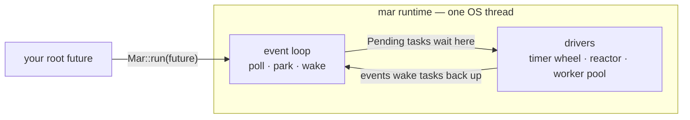

# mar — a mini async runtime

`mar` is a small, from-scratch async runtime for Rust, written to teach how
runtimes like tokio work under the hood. It implements the full stack you need
to run `async/await` code on one thread: an executor that polls futures, a
timer heap for `sleep`, a reactor that waits on OS readiness for I/O, and a
worker pool for blocking work.

Everything is kept deliberately small and single-threaded so each piece can be
read, understood, and held in your head at once.

## The big picture



## Main components

### `Mar` — the executor
The public entry point. `Mar::run(future)` creates the runtime, inserts your
future as the root task, and drives an event loop until nothing is left to do.
The loop has one job: poll every task that is ready, park the thread when
nothing is, and wake tasks back up when something happens.

### Ready queue and task map
Two plain collections that are the executor's memory. The **ready queue**
lists which tasks are due to be polled next; the **task map** holds each live
task (a future plus an id) so the executor can find it again after a wake.
`run()` returns only when both are empty.

### `waker` — how tasks ask to be polled again
Every future is polled with a `Waker`. This one is built from scratch on an
`Rc<RefCell<…>>` — the whole runtime is single-threaded, so no `Arc` or locks
are needed. Waking a task just pushes its id onto the ready queue.

### Timer heap — `sleep` (and `yield_now`)
A priority queue of `(deadline, id, Waker)` shared by the executor and every
sleeping future. `Mar` uses the earliest deadline to decide how long to park;
when a deadline passes, the waker stored in the entry fires and the task's id
lands back on the ready queue. A dropped `sleep` removes its entry, so a
cancelled timer can never hang the loop. `yield_now()` lives in
`mar::task::yield_now` — it self-wakes without touching the timer heap.

### Reactor — I/O readiness
Wraps `mio::Poll`, the OS-level poller, so the executor can wait for sockets to
become readable or writable instead of busy-looping. The reactor maps each
registered source to the waker of the task parked on it; when a readiness event
arrives it wakes that task. `io::read` and `io::write` are the futures that
register and deregister sources here.

### Worker pool — `spawn_blocking`
Blocking work (file I/O, HTTP calls, CPU-heavy jobs) is moved off the executor
thread onto a small pool of worker threads. `spawn_blocking(|| …)` sends the
closure to a worker and returns a future that completes with the result. When a
worker finishes it signals the executor through a cross-thread waker, and the
blocking task's id lands back on the ready queue.

### Thread-local context
Free functions like `sleep()`, `yield_now()`, `io::read`, and `spawn_blocking`
need to reach the runtime's internals without taking explicit handles. `run()`
installs a single `ContextHandle` in a thread-local slot (the same pattern tokio
uses), so user code stays ergonomic and the wiring stays invisible.

## The run cycle, in one paragraph

`Mar::run` drains the ready queue, polling each task until it returns `Pending`
and re-enqueues itself, or finishes. When the queue is empty it computes the
next timer deadline and parks on the reactor — the thread sleeps until a timer
fires, a socket becomes ready, or a worker finishes. Each event wakes the
matching task back onto the queue, and the loop repeats. When the queue, task
map, timer heap, reactor, and blocking-waker map are all empty, the runtime
shuts down and `run()` returns.

## Design choices, on purpose

- **Single-threaded and `!Send`**: all shared state is `Rc<RefCell<_>>`, which
  keeps the code simple and lock-free. A single OS thread runs all futures.
- **Custom `RawWaker`**: built by hand so its payload can be an `Rc` instead of
  an `Arc` — a nice place to learn exactly what a `Waker` really is.
- **One-shot I/O futures**: `io::read`/`io::write` consume the socket they wrap
  and complete after a single operation, keeping the reactor logic tiny.
- **Deliberate cancellation**: dropping a `sleep`, an I/O future, or a blocking
  task mid-flight cleans up its registration, so the loop can always tell when
  it is truly done.

## Examples

Each example highlights one way the pieces combine:

| Example | What it shows |
| --- | --- |
| `examples/countdown.rs` | Timer heap only — a stopwatch that counts down with `sleep` |
| `examples/compute_with_spinner.rs` | `spawn_blocking` running a long job in parallel with a `sleep`-based progress spinner |
| `examples/retry_with_backoff.rs` | `spawn_blocking` + timer heap — retries with exponential backoff |
| `examples/fetch_to_file.rs` | `spawn_blocking` for HTTP and file I/O — fetch, write, read back |
| `examples/local_echo_server.rs` | Reactor + worker pool — accepts connections with `spawn_blocking`, relays bytes with `io::read`/`io::write` |

Run any example with, e.g.:

```sh
cargo run --example countdown
```

## Repository layout

```
src/
  mar.rs          the executor and public entry point
  task/           Task, spawn_blocking, yield_now, worker pool
    mod.rs        Task struct + re-exports
    blocking.rs   BlockingTask + spawn_blocking
    yield_now.rs  YieldNow + yield_now()
    worker_pool.rs  WorkerPool + Job
  context.rs      single thread-local context for all free functions
  runtime_state.rs  the shared ready queue, task map, and blocking-waker map
  waker.rs        the hand-built waker used by the executor
  time.rs         sleep and the TimerHeap deadline heap
  reactor.rs      mio::Poll wrapper, token allocation, event dispatch
  io.rs           one-shot read/write futures
tests/
  core.rs         integration tests: interleaving blocking work with timers
examples/         runnable demos, see table above
docs/             deeper explanations of each component, see below
```

## Component docs

Each component of the runtime has its own deep-dive, including how it works,
how it interacts with the rest, and which tests document its behavior:

| Doc | Component |
| --- | --- |
| [docs/executor.md](docs/executor.md) | `Mar` — the executor and its event loop |
| [docs/task.md](docs/task.md) | `Task` — a pollable future, tagged with an id |
| [docs/runtime-state.md](docs/runtime-state.md) | `RuntimeState` — ready queue, task map, blocking-waker map |
| [docs/waker.md](docs/waker.md) | The hand-built waker |
| [docs/time.md](docs/time.md) | Timer heap — `sleep` and the deadline heap |
| [docs/reactor.md](docs/reactor.md) | Reactor — `mio::Poll` wrapper, tokens, dispatch |
| [docs/io.md](docs/io.md) | `io::read` / `io::write` one-shot futures |
| [docs/blocking.md](docs/blocking.md) | `WorkerPool` and `spawn_blocking` |
