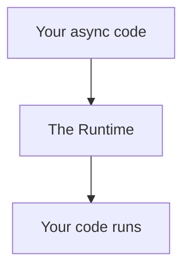
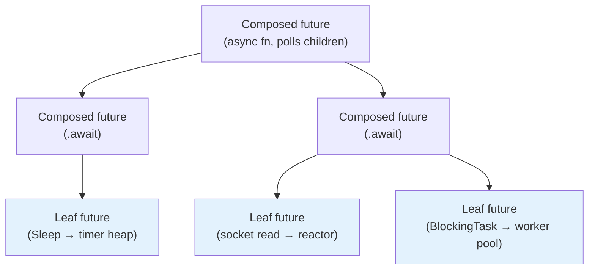
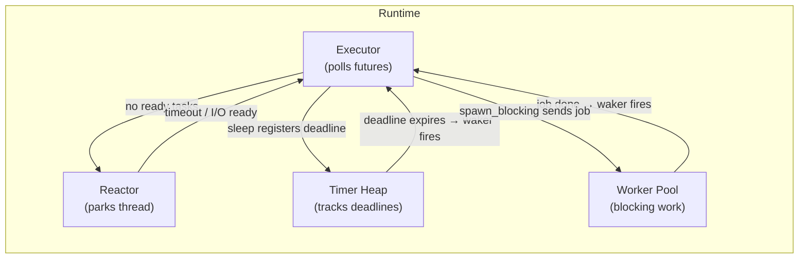
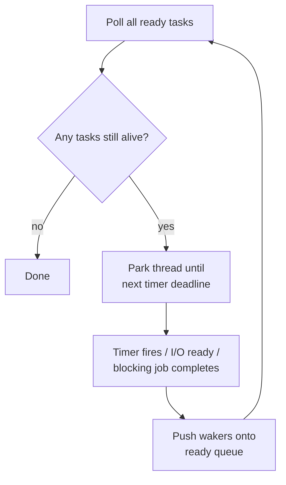
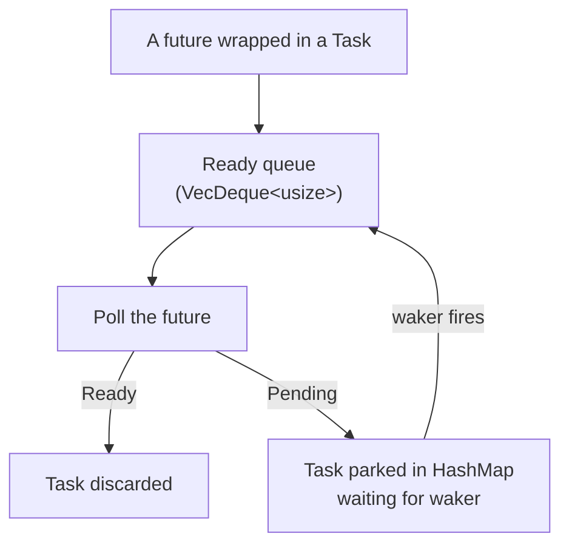
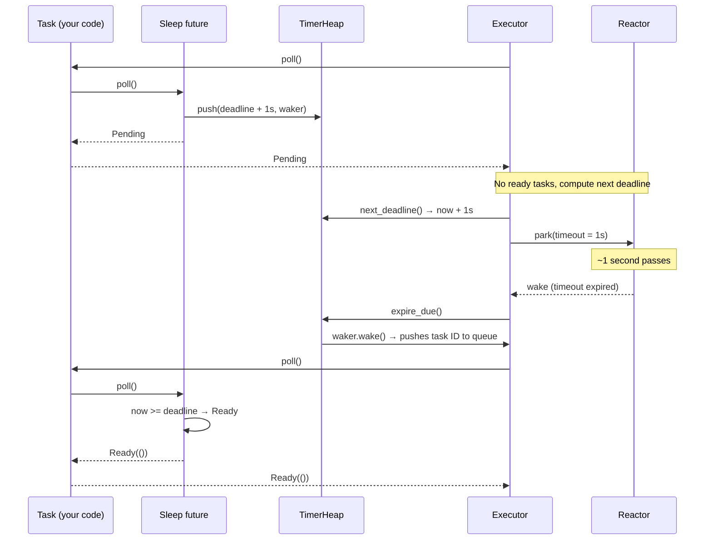
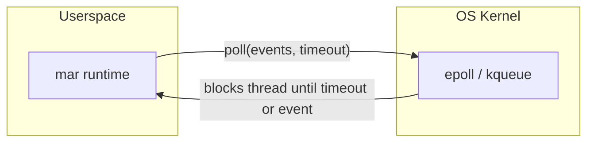
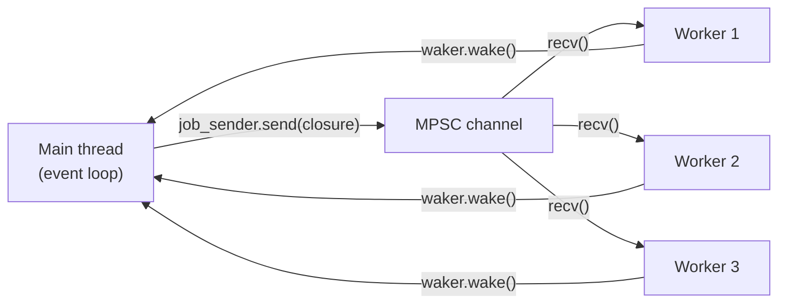
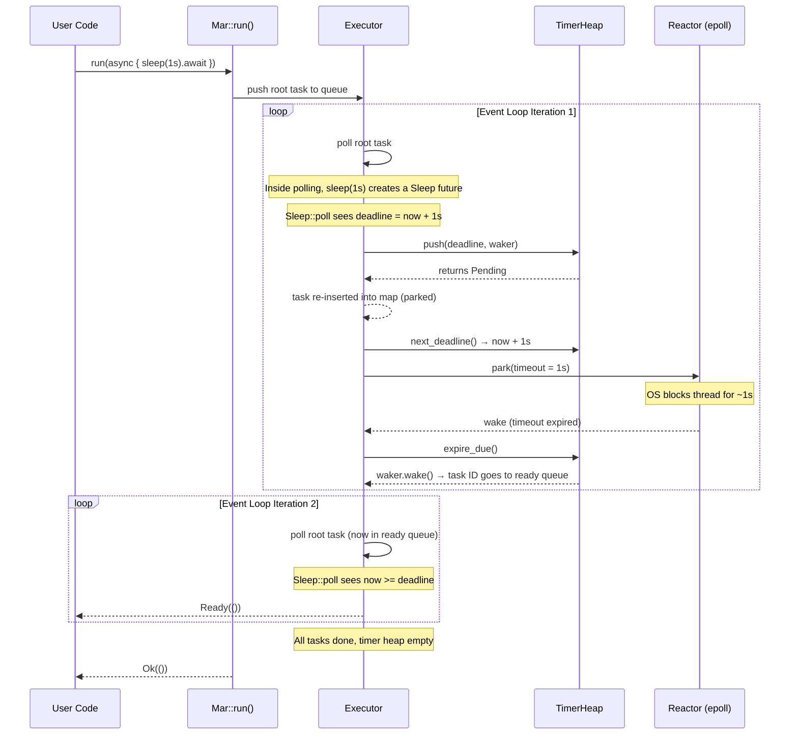
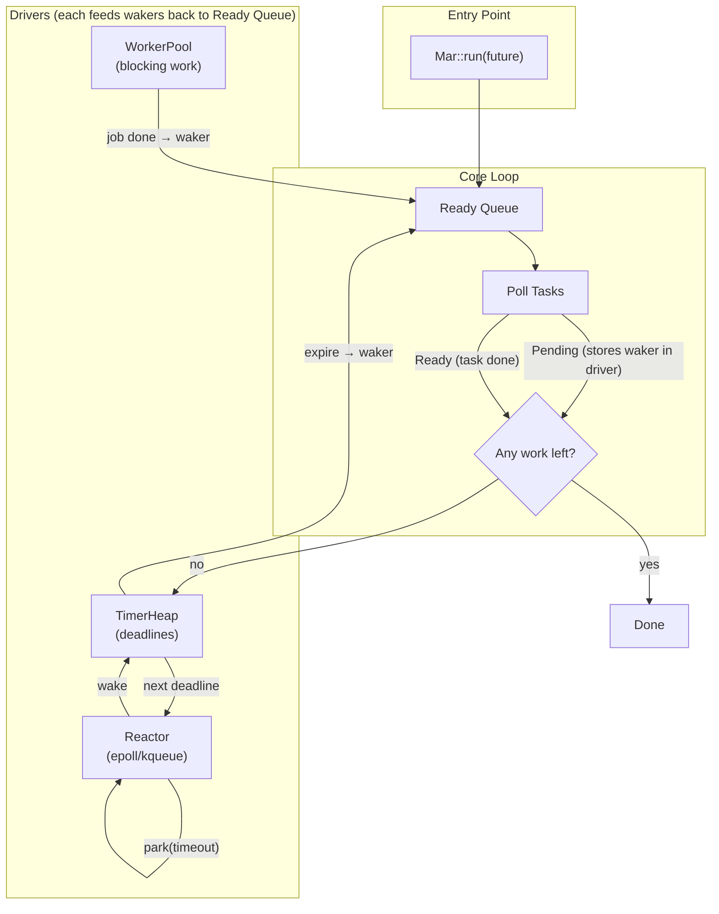

# mar: a mini async runtime

## 1. Why this exists

`mar` is an educational project. Its purpose is to demystify what happens behind `async` and `.await` in Rust.

Rust's language-level `async/await` gives you syntax for writing futures and pausing execution, but it does not ship with any mechanism for actually running them. In C#, Node.js, or Go, `async`/`await` and `goroutines` come with a built-in runtime that schedules and polls them to completion. Rust deliberately leaves that out, keeping the standard library small and the language unopinionated about concurrency. Instead of shipping a runtime, it ships the components to build one: the `Future` trait, `Pin` for memory safety, and `Waker` for notification. 

This means Rust developers who want to use `async`/`await` either have to build their own runtime or use one built by someone else. The ecosystem offers plenty of options: **tokio**, the de facto standard used by most production projects; **async-std**, which mirrors the standard library's own API; **smol**, a deliberately small and embedded-friendly runtime; and **embassy**, which targets microcontrollers without an OS. These runtimes are powerful and battle-tested, but they are also notoriously hard to wrap your head around. Their codebases span tens of thousands of lines, much of it focused on optimizations beyond the fundamentals: work-stealing schedulers, I/O drivers, slab allocators, async synchronization primitives, and cancellation safety, to name a few. Reading tokio's source is reading years of performance optimizations and niche features that obfuscate what is actually needed for an async runtime.

`mar` attempts to be the opposite: a small runtime that genuinely executes async Rust. A few hundred lines, single-threaded at its core, and completely macro-free, with every piece of boilerplate written out so that it's visible and learnable rather than hidden behind ergonomic abstractions. No optimization you can't see through, and every component — the executor, reactor, timer heap, and worker pool — is reduced to its bare minimum.



---

## 2. What is a future?

The `Future` trait is the core abstraction Rust's async model is built on. Here it is, simplified from the standard library:

```rust
pub trait Future {
    type Output;
    fn poll(self: Pin<&mut Self>, cx: &mut Context<'_>) -> Poll<Self::Output>;
}

pub enum Poll<T> {
    Ready(T),
    Pending,
}
```

A future is just something you can call `poll` on. Each call to `poll` either returns `Ready(value)`, the work is done, or `Pending`, the work is not done yet, try again later. That's it. No threads, no callbacks, no hidden machinery. Just a function you call repeatedly until it gives you a value.

The `Pin` wrapper guarantees the future won't be moved in memory between polls. This matters because the compiler-generated state machine may contain self-referential pointers (a field pointing to another field of the same struct). If the struct were moved, those pointers would dangle.

The `Context` carries a `Waker`, the mechanism a future uses to tell the executor "I might be ready now, poll me again." A future that returns `Pending` must have stored the waker somewhere so that when the thing it's waiting for becomes ready, the waker can fire.

### Leaf futures vs. composed futures

Futures come in two flavors:

**Leaf futures** are the primitives, futures that don't `.await` anything themselves. They are the bottom of the call tree. Examples: a `Sleep` future that talks directly to the timer heap, a socket read future that registers with the reactor, a `BlockingTask` that submits work to the worker pool. A leaf future returns `Pending` because it's waiting on something external (a timer, the OS, a thread), and stores the waker with that external thing.

**Composed futures** are what you write with `async fn` or `async` blocks. They `.await` other futures (leaf or composed), and the compiler stitches them together into a state machine. When a composed future is polled, it polls the inner future it's awaiting. If that returns `Pending`, the composed future returns `Pending` too, and this chain of `Pending` propagates all the way down until it reaches a leaf future that actually registers a waker with an external system.

Leaf futures connect the async world to the outside world. Composed futures are just plumbing between your code and the leaf futures.



Here, every node is a future. The composed futures (plain) just poll their children; the leaf futures (shaded) are the ones that actually register a waker with an external system — a timer, the OS, or a thread.

---

## 3. What does a runtime actually do?

The runtime is what calls `poll`. If leaf futures are the bridge to the outside world, the runtime is the engine that keeps traffic moving: it polls futures, parks when nothing is ready, and wakes up when a waker fires.

Here's a concrete example. You write this:

```rust
async fn foo(input: u32) -> u32 {
    let a = async_op(input).await;
    let b = async_op(a).await;
    a + b
}
```

The compiler roughly produces the following (this is a conceptual approximation, not exact compiler output):

```rust
enum FooState {
    Start { input: u32 },
    AfterFirstAwait { a: u32 },
    AfterSecondAwait { a: u32, b: u32 },
    Done,
}

struct FooFuture {
    state: FooState,
    inner_future: Option<AsyncOpFuture>,
}

impl Future for FooFuture {
    type Output = u32;

    fn poll(mut self: Pin<&mut Self>, cx: &mut Context<'_>) -> Poll<u32> {
        loop {
            match &self.state {
                FooState::Start { .. } => {
                    // move to next state and begin polling inner future
                }
                FooState::AfterFirstAwait { .. } => {
                    // poll inner future; if Ready, extract a and transition again
                }
                FooState::AfterSecondAwait { a, b } => {
                    return Poll::Ready(a + b);
                }
                FooState::Done => panic!("polled after completion"),
            }
        }
    }
}
```

Every `.await` becomes a state transition. The future stops at each `.await` point, returns `Poll::Pending` if the inner future isn't ready, and resumes from that point when polled again. The compiler handles all of this automatically.

Rust does *not* provide anything that calls `poll` for you. That's the runtime's job.

In one sentence: **a runtime polls futures when they can make progress, and parks the thread when no future is ready to advance.**

To do this, a runtime needs three things:

1. **An executor:** a loop that holds a set of futures and polls them. When a future returns `Ready`, it's done. When it returns `Pending`, the executor puts it aside and trusts it will be woken up later.

2. **A reactor:** a way to block the thread on OS-level events (timers expiring, sockets becoming readable) instead of spinning in a busy loop burning CPU.

3. **A timer:** a data structure that tracks deadlines so that `sleep(Duration::from_secs(1))` actually waits one second instead of returning instantly or busy-looping.

`mar` adds a fourth because real code always needs it:

4. **A worker pool:** a small set of background threads for work that would block the main async thread (heavy computation, synchronous file I/O).

These four pieces share one critical mechanism: the **Waker**. When a future returns `Pending`, it stores a `Waker` somewhere (in the timer heap, in the reactor's event registry, in the worker pool's completion queue). Later, when the thing the future was waiting for becomes ready, the waker fires, pushing the future's task back onto the executor's ready queue so it gets polled again.



---

## 4. The event loop

Everything `mar` happens inside a single function: `Mar::run()`. You hand it a root future, and it drives that future, and any futures spawned from it, to completion. Here is the loop in pseudocode:

```
Mar::run(root_future):
    push root_future onto the ready queue

    loop:
        while there are tasks in the ready queue:
            pop a task
            poll it with its waker
            if it returns Ready: discard it
            if it returns Pending: set it aside (it will re-enter the queue when woken)

        if no tasks live anywhere (ready queue, timer heap, blocking pool):
            break   // all work is done

        compute the earliest timer deadline
        park the thread via epoll/kqueue until that deadline (or forever if no timers)

        pop all expired timers → wake their tasks
        process any I/O events → wake their tasks
        process any blocking-job completions → wake their tasks

        // loop back to the top, ready queue is now populated again
```

This is the fundamental shape of every async runtime. Tokio's loop looks different, it has multiple threads, each with its own loop, and they steal work from each other, but the purpose is identical: **poll everything that's ready, park the thread, wake up when something changes, repeat**.



The beauty of this loop is that it never busy-waits. When there's nothing to do, the OS puts the thread to sleep. When there's something to do, the OS wakes the thread. The CPU is idle exactly when no work is pending.

---

## 5. The executor: driving futures to completion

The executor answers a single question: *which future do I poll next?*

In `mar`, the executor is not a separate struct. It is the `RuntimeState`, a bag of shared data held behind `Rc<RefCell<>>`, plus the polling logic inside the event loop. Together they manage the lifecycle of tasks.

### Tasks

A `Task` is a heap-allocated, pinned, type-erased future:

```rust
pub struct Task {
    id: usize,
    future: Pin<Box<dyn Future<Output = ()>>>,
}
```

Every future that enters the runtime gets wrapped in a `Task`. It's boxed so it has a stable address on the heap (we'll move the `Task` around but the inner future stays put). It's pinned because async state machines may be self-referential, the compiler-generated struct might contain pointers into its own fields, and pinning guarantees those pointers remain valid.

Type erasure through `dyn Future` means the executor can hold many different future types in the same data structure without generics exploding everywhere.

### The ready queue

```rust
pub queue: Arc<Mutex<VecDeque<TaskId>>>  // FIFO queue of task IDs
pub tasks: HashMap<usize, Task>  // all live tasks
```

The ready queue holds task IDs, not the tasks themselves. The tasks live in a `HashMap` keyed by ID. This separation matters: a task that returned `Pending` is *not* in the queue, but it is still in the map. It sits there until its waker fires and pushes its ID back onto the queue. This is the mechanism by which a future "parks" itself, it leaves the queue, waits in the map, and relies entirely on its waker to get re-queued.

When a task returns `Ready`, it is removed from both the queue and the map. It ceases to exist.



### Polling

At the top of every loop iteration, the executor drains the ready queue:

```rust
while let Some(id) = state.queue.lock().unwrap().pop_front() {
    let Some(mut task) = state.tasks.remove(&id) else { continue; };
    let waker = task.waker().clone();
    let mut cx = Context::from_waker(&waker);
    match task.poll(&mut cx) {
        Poll::Pending => { state.tasks.insert(id, task); }
        Poll::Ready(()) => {}
    }
}
```

Notice the task is *removed from the map* before polling and only *re-inserted* if it returns `Pending`. This avoids double-borrow issues with `RefCell`. The map never contains a task that is currently being polled.

### The Waker

The waker is how the executor gets notified that a parked task might be ready. `mar` uses the standard library's `Wake` trait instead of hand-rolling a `RawWaker`:

```rust
struct TaskWaker {
    queue: Arc<Mutex<VecDeque<TaskId>>>,
    id: TaskId,
}

impl Wake for TaskWaker {
    fn wake(self: Arc<Self>) {
        self.queue.lock().unwrap().push_back(self.id);
    }
}
```

`Wake` is the safe, zero-`unsafe` way to build wakers. Implement it on an `Arc<Self>`, and the standard library generates the vtable, clone, `wake_by_ref`, and drop for free — no raw pointers, no hand-written reference-counting.

The trade-off is that `Waker::from(Arc<T>)` requires `T: Send + Sync`, so the ready queue must live in an `Arc<Mutex<>>` instead of an `Rc<RefCell<>>`. The lock is always uncontended (the runtime is single-threaded), so `lock().unwrap()` is a trivial operation.

When any component (timer, reactor, worker pool) calls `waker.wake()`, the task's ID is pushed onto the ready queue. The next time the executor reaches the top of the loop, it finds the task and polls it.

---

## 6. The timer: making sleep work

Async code cannot call `std::thread::sleep()`. Doing so would block the single OS thread and freeze the entire runtime. Instead, `sleep()` in async code means: *park this task and wake me up after at least this much time has passed*.

### The timer heap

`mar` uses a min-heap (`BinaryHeap<Reverse<TimerEntry>>`) to track deadlines:

```
TimerEntry { deadline: Instant, id: usize, waker: Waker }
```

The entry with the **earliest** deadline sits at the top of the heap. Each entry stores a `Waker` alongside its deadline. When the deadline expires, the heap pops the entry and calls `waker.wake()` to push the task back onto the ready queue.

### How sleep() works

When you call `time::sleep(duration)`, you get a `Sleep` future. On its first poll:

1. If the deadline is already in the past, it returns `Ready` immediately.
2. If the deadline is in the future, it pushes `(deadline, waker)` into the timer heap and returns `Pending`.

The waker it pushes is the one from the `Context` it was polled with, meaning it's the waker for the task that called `sleep`. When the timer fires, that task gets re-queued, gets polled again, and the `Sleep` future returns `Ready`.



### Integration with the reactor

The timer heap doesn't run on its own thread. It's checked in two places:

1. **Before parking:** the executor calls `next_deadline()` to get the earliest timer deadline. This becomes the reactor's park timeout. If the earliest timer is 500ms away, the reactor parks for at most 500ms, the OS will wake the thread when that time passes.

2. **After waking:** the executor calls `expire_due()` to pop all timers whose deadline has passed and wake their tasks. This handles both normal timer expiry and the case where multiple timers expired while the thread was parked.

This design means timers are not perfectly precise: a timer can fire up to one event-loop-iteration late if the executor is busy polling other tasks. But it is correct: no timer fires *before* its deadline.

---

## 7. The reactor: parking the thread on OS events

If the executor looped forever checking "is anything ready yet?", it would peg the CPU at 100% doing nothing useful. The reactor solves this by handing the waiting problem to the operating system.



`mar`'s reactor is a thin wrapper around `mio::Poll`, which in turn wraps `epoll` on Linux and `kqueue` on macOS. These are the same system calls tokio uses. The key operation is:

```rust
reactor.park(&mut events, timeout)
```

This blocks the OS thread until one of two things happens:
- **A registered event source becomes ready** (an I/O socket, a waker token, etc.)
- **The timeout expires** (set to the next timer deadline)

The reactor currently registers two things: a `mio::Waker` (used by the worker pool to wake the event loop when a blocking job finishes) and, in principle, any I/O sources the user registers. The waker token is a simple "someone rang the doorbell" signal. When it fires, the executor knows to check for completed blocking jobs.

### What parking actually is

Parking is a system call that tells the operating system: "I have nothing to do. Put this thread to sleep, and only wake it when one of these specific things happens." The word "park" is just a term used in async runtimes. At the OS level there is no function called `park`. The actual system call depends on your operating system.

On Linux, the system call is `epoll_wait`. On macOS, it's `kevent`. `mio::Poll::poll()` calls one of these depending on what platform you're on.

Here is what the OS does when a thread calls `epoll_wait`.

The first thing the kernel does is mark your thread as **blocked**. To understand what that means, think about how the OS scheduler sees your thread at any given moment. A thread can be in one of three states:

- **Running**, it's right now sitting on a CPU core, executing instructions.
- **Runnable**, it wants to run, but all cores are busy, so it's waiting in line.
- **Blocked**, it can't run. It's waiting for something outside the CPU: a network packet, a disk read, a timer. The scheduler doesn't even look at blocked threads. They might as well not exist.

Blocking your thread is what makes parking efficient. A blocked thread consumes zero CPU. The scheduler skips it on every pass through the run queue as if it were invisible.

Next, the kernel records *why* your thread is blocked. `epoll_wait` takes two arguments: an epoll file descriptor and a timeout. The epoll fd is something your code created earlier with `epoll_create` and then registered interest in with `epoll_ctl`, basically saying "I care about this socket becoming readable" or "let me know when this file descriptor is writable." The kernel makes a note: **thread 742 is blocked on epoll fd 42, timeout 500ms**. That's all it needs to know.

If you gave it a timeout, the kernel also programs a hardware timer. The CPU has a programmable interval timer built into it, a circuit that can generate an interrupt after a set duration. The kernel tells it "buzz me in 500 milliseconds." When 500ms passes, the timer fires an interrupt, and the kernel's timer handler runs. That handler will wake your thread.

At this point your thread is off the CPU. The scheduler looks around for another runnable thread to take the core. If this is a single-threaded runtime and there's nothing else to run, the CPU enters an **idle state**. It literally halts, stops fetching instructions, and waits for the next interrupt. In this state it draws almost no power.

Meanwhile, one of two things eventually happens:

Maybe a network packet arrives. The kernel's network driver processes it, looks at which socket it belongs to, and notices, hey, that socket is registered with epoll fd 42. The kernel immediately marks the epoll instance as having a ready event. Then it finds thread 742, moves it from blocked to runnable, and drops it in the scheduler's run queue.

Or maybe the 500ms timer expires. The timer interrupt fires, the kernel's handler runs, sees that epoll fd 42's timeout elapsed, and does the same thing: marks the thread runnable, puts it in the queue.

When the scheduler eventually gets around to thread 742, `epoll_wait` returns. It hands back a list of which file descriptors are ready. That's the moment the event loop in `mar.rs` wakes up: it reads the events, fires any expired timers, wakes tasks whose wakers were poked, and starts polling futures again. The whole cycle repeats.

### Why this matters for a runtime

Without parking, the event loop would have to keep re-checking everything in a tight loop:

```
while not done:
    poll everything
    check timers
    // ... immediately loop back, CPU at 100%
```

This is a busy loop. The thread never blocks, so the scheduler keeps giving it CPU time. Every cycle through the loop just sees "nothing ready yet" and spins again. The CPU stays at 100% even when there's no work.

With parking, the thread blocks inside the OS kernel. The scheduler removes it from consideration entirely. The CPU can go idle or run other processes. The thread only gets CPU time again when there's actually something to do. This is the difference between a runtime and a benchmarking toy.

### The timeout

The timeout passed to `epoll_wait` is always driven by the timer heap. The event loop computes it right before calling `reactor.park()`:

```rust
let timeout = time::next_deadline(&runtime.wheel)
    .map(|deadline| deadline.saturating_duration_since(Instant::now()));
```

- If no timers are pending and no I/O is registered, the timeout is `None` → the kernel blocks the thread forever until an event arrives.
- If the next timer deadline is 500ms away, the timeout is `Some(500ms)` → the kernel blocks for at most 500ms.
- If a timer deadline has already elapsed by the time we call `park`, the timeout is `Some(Duration::ZERO)` → the kernel returns immediately (doesn't block at all), so the executor can fire the overdue timers via `expire_due()`.

So parking lets us wait efficiently for timers and I/O events without burning CPU. But some work can't be structured as "wait for an event." If a future spends 200ms computing a hash on the main thread, nothing else can run during that time: no timers fire, no sockets are checked, the whole runtime freezes.

---

## 8. The worker pool: offloading blocking work

Not everything can be made async. Some operations (reading a large file synchronously, running a CPU-heavy computation, calling a blocking C library) would stall the entire runtime if run on the main thread. The worker pool offloads this work to background threads.

### Architecture

The worker pool is a fixed-size set of OS threads (mar hardcodes 3 by default) connected to the main thread via an MPSC channel:



### The flow

1. **You call `task::spawn_blocking(|| some_heavy_work())`.** This returns a `BlockingTask<R>` future.

2. **The future is polled.** On first poll, it registers its waker in `state.blocking_wakers` and sends the closure through the MPSC channel to the worker threads.

3. **A worker thread picks it up.** One of the background threads receives the closure, runs it, and captures the result. If the closure panics, the panic is caught with `catch_unwind` and shipped back.

4. **The worker signals completion.** After the job finishes, the worker thread calls `waker.wake()` on the `mio::Waker`. This triggers the reactor to wake from its park.

5. **The executor processes the wake.** Back in the event loop, the executor sees the waker token fired. It collects all wakers from `blocking_wakers` and calls `wake_by_ref()` on each one.

6. **The `BlockingTask` is polled again.** It finds the result waiting in its MPSC receiver, returns `Ready(result)`, and the original task continues.

### Why not just run blocking code directly?

Sometimes blocking the main thread is fine. If you're building a simple CLI tool or a single-purpose service with no other concurrent tasks, running `std::fs::read` directly won't hurt anything, there's nothing else waiting to run. But if your runtime is juggling multiple tasks, timers, and I/O, a blocking call on the main thread stalls everything. The worker pool is for those cases: tasks where you *don't* want to block the main thread because it would freeze timers, I/O, and every other task waiting to make progress.

---

## 9. How it all fits together

Let's trace `Mar::run(async { time::sleep(Duration::from_secs(1)).await })` end to end. This single line of code exercises the executor, the timer, the reactor, and the waker mechanism.



Here's the full architecture at a glance:



### Revisiting the key insight

At every level, the pattern is the same: **a task yields by returning `Pending` and storing its `Waker` somewhere. Later, when the condition it was waiting for becomes true, the waker fires, the task goes back into the ready queue, and it gets polled again.**

- For `sleep()`: waker goes in the timer heap. Fires when the deadline expires.
- For I/O: waker goes in the reactor's event registry. Fires when the socket is ready.
- For `spawn_blocking()`: waker goes in `blocking_wakers`. Fires when a worker thread finishes the job.

The executor doesn't know or care *why* a task returned `Pending`. It trusts the waker. This separation of concerns, the executor schedules, the drivers wake, is what makes the architecture composable and extensible.

---

## 10. What's not here (and why)

`mar` is intentionally minimal. Every feature omitted is a deliberate choice to keep the codebase small enough to hold in your head. Here's what you won't find:

**No multi-threaded executor.** `mar` runs everything on one OS thread. There is one ready queue, one reactor, one timer heap. Adding multiple event loops with work-stealing would roughly double the line count and obscure the core concepts.

**No work-stealing.** Even in a multi-threaded setup, who decides which thread polls which task? Tokio uses work-stealing, idle threads grab tasks from busy threads' queues. This is an optimization, not a prerequisite for understanding async runtimes.

**No network I/O drivers.** Sockets, TCP listeners, TLS, these require extensive platform-specific code. `mar` has the reactor (the `epoll` wrapper) so the infrastructure is there, but the I/O driver layer is left as an exercise.

**No channels or synchronization primitives.** Things like `tokio::sync::mpsc` or `Mutex` are built on top of the runtime's waker infrastructure. They're downstream consumers, not core runtime components.

**No performance tuning.** `mar` does simple things simply. No slab allocators, no intrusive linked lists, no cache-line padding. Production runtimes do all of these things and more.

If you understand `mar`, you understand the skeleton of tokio. The rest, as impressive as it is, is optimization and breadth. The architecture is the same: event loop, executor, reactor, timer, waker. Everything else is detail.
