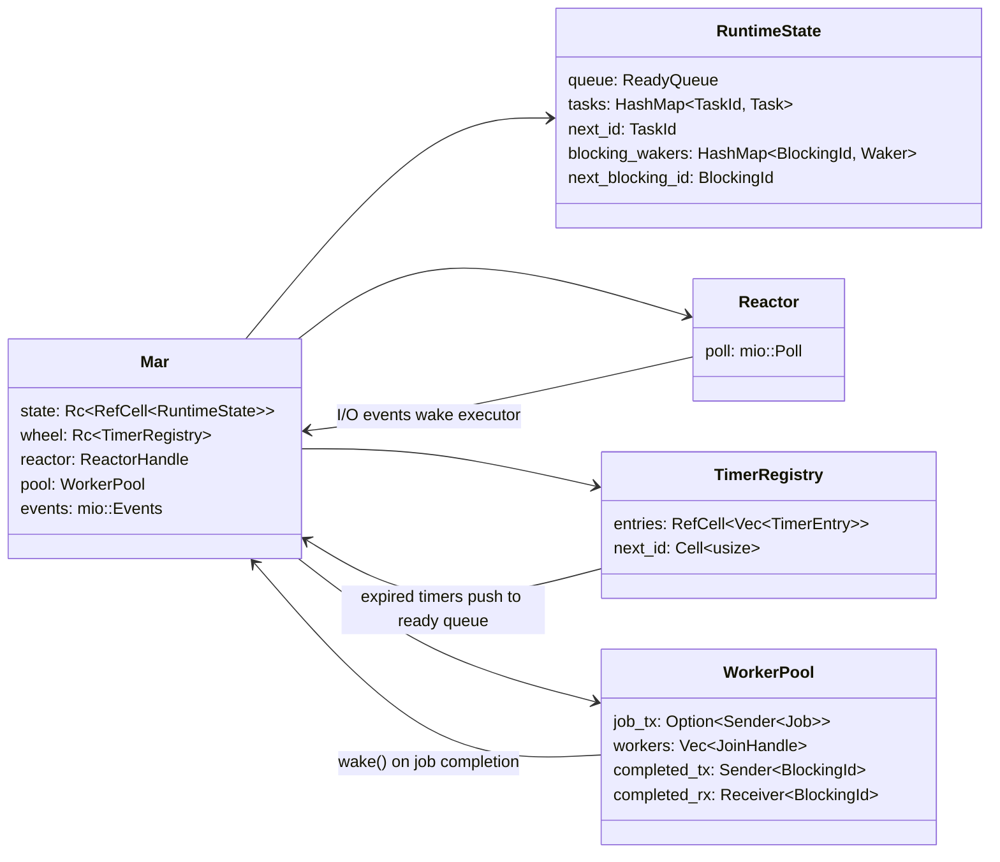
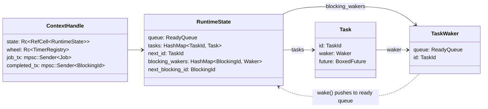

## Top-Level Components

The executor and the subsystems it composes to form a working runtime.

- [Mar](docs/mar.md) — the executor loop: poll I/O, drain timers, run tasks
- [Reactor](docs/reactor.md) — mio-based I/O event polling
- [TimerRegistry](docs/timer-registry.md) — deadline tracking and timer expiry
- [WorkerPool](docs/worker-pool.md) — thread pool for `spawn_blocking`

## Runtime Primitives

The foundational scheduling abstractions. Every future ultimately interacts with these four.

- [ContextHandle](docs/context-handle.md) — thread-local handle to reach runtime services
- [RuntimeState](docs/runtime-state.md) — scheduling state: ready queue, task table, blocking wakers
- [Task](docs/task.md) — a pinned, boxed future + waker, the unit of work
- [TaskWaker](docs/task-waker.md) — the `Wake` implementation that re-queues a task
