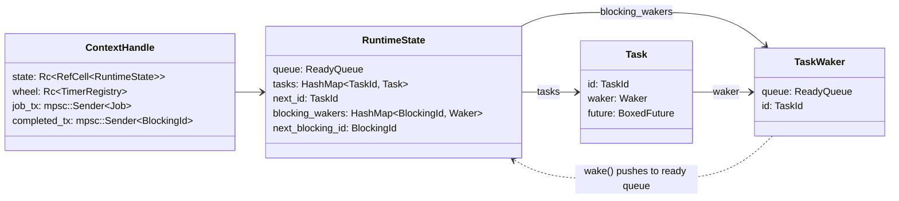

```mermaid
classDiagram
    direction LR

    class ContextHandle {
        state: Rc~RefCell~RuntimeState~~
        wheel: Rc~TimerRegistry~
        job_tx: mpsc::Sender~Job~
        completed_tx: mpsc::Sender~BlockingId~
    }

    class RuntimeState {
        queue: ReadyQueue
        tasks: HashMap~TaskId, Task~
        next_id: TaskId
        blocking_wakers: HashMap~BlockingId, Waker~
        next_blocking_id: BlockingId
    }

    class Task {
        id: TaskId
        waker: Waker
        future: BoxedFuture
    }

    class TaskWaker {
        queue: ReadyQueue
        id: TaskId
    }

    ContextHandle --> RuntimeState
    RuntimeState --> Task : tasks
    RuntimeState --> TaskWaker : blocking_wakers
    Task --> TaskWaker : waker
    TaskWaker ..> RuntimeState : wake() pushes to ready queue
```
