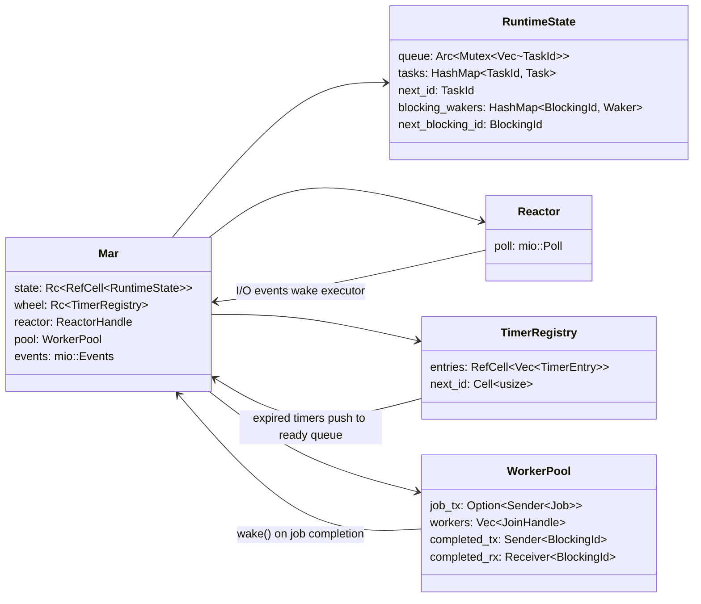

```mermaid
classDiagram
    direction LR

    class Mar {
        state: Rc~RefCell~RuntimeState~~
        wheel: Rc~TimerRegistry~
        reactor: ReactorHandle
        pool: WorkerPool
        events: mio::Events
    }

    class RuntimeState {
        queue: Arc~Mutex~Vec~TaskId~~
        tasks: HashMap~TaskId, Task~
        next_id: TaskId
        blocking_wakers: HashMap~BlockingId, Waker~
        next_blocking_id: BlockingId
    }

    class Reactor {
        poll: mio::Poll
    }

    class TimerRegistry {
        entries: RefCell~Vec~TimerEntry~~
        next_id: Cell~usize~
    }

    class WorkerPool {
        job_tx: Option~Sender~Job~~
        workers: Vec~JoinHandle~
        completed_tx: Sender~BlockingId~
        completed_rx: Receiver~BlockingId~
    }

    Mar --> RuntimeState
    Mar --> Reactor
    Mar --> TimerRegistry
    Mar --> WorkerPool
    Reactor --> Mar : I/O events wake executor
    TimerRegistry --> Mar : expired timers push to ready queue
    WorkerPool --> Mar : wake() on job completion
```
