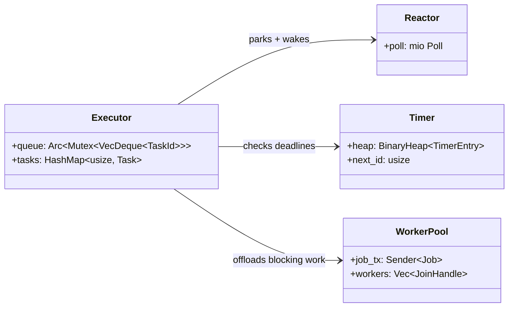

```mermaid
classDiagram
    direction LR

    class Executor {
        +queue: Arc~Mutex~VecDeque~TaskId~~~
        +tasks: HashMap~usize, Task~
    }

    class Reactor {
        +poll: mio Poll
    }

    class Timer {
        +heap: BinaryHeap~TimerEntry~
        +next_id: usize
    }

    class WorkerPool {
        +job_tx: Sender~Job~
        +workers: Vec~JoinHandle~
    }

    Executor --> Reactor : parks + wakes
    Executor --> Timer : checks deadlines
    Executor --> WorkerPool : offloads blocking work
```
